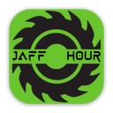
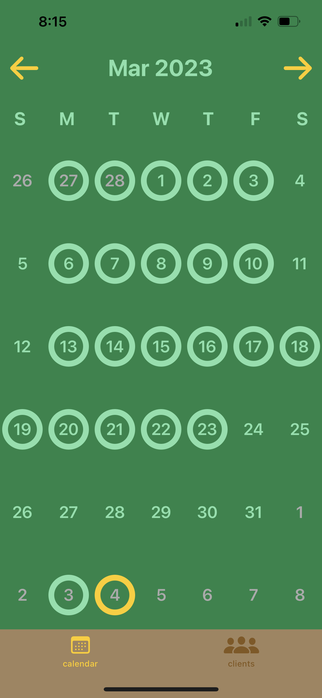
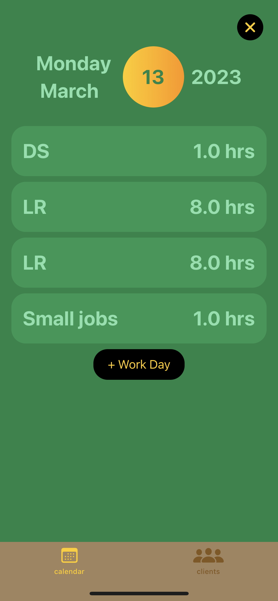
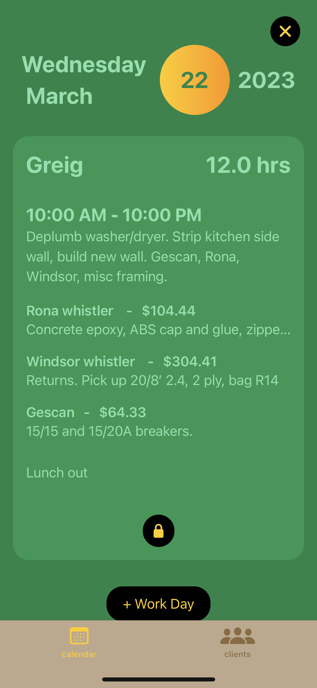
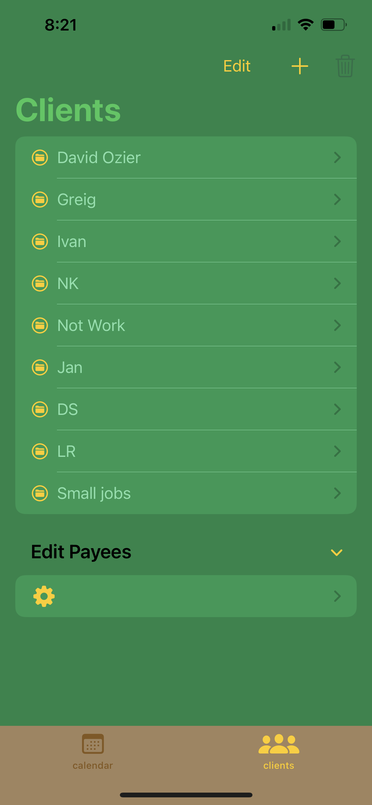
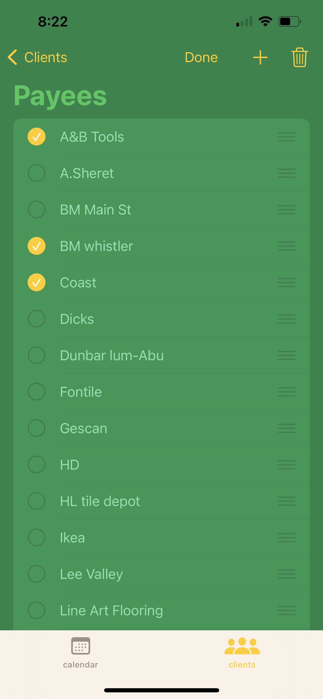
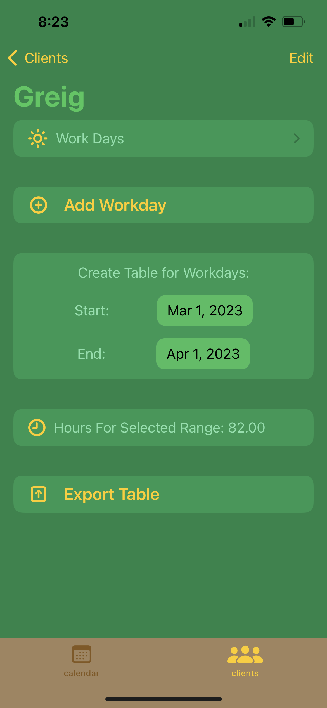

# Jaffhour - Time and Expense Tracker

- Simple organization for self employed homies 
- Allows for easy record keeping of: projects, hours worked, tasks, and expenses
- Export data in CSV format to seamlessly integrate with external book keeping and invoicing software
- iOS 16.0 +

## About

Struggling to keep accurate records of all the work you're doing? Look no further than Jaffhour! This app will let you organize your projects and log your work with ease. Come invoice time, just select a date range and export your entries for the billing period in a tidy CSV file.

Uses [CodableCSV](https://github.com/dehesa/CodableCSV) for table export functionality.

Stay tuned for a potential **one-time** release on the app store

## Demo

https://github.com/aidanmeharg/jaffhour/assets/115366694/b7f5f426-6657-43d9-8647-e1d06898b83b

https://github.com/aidanmeharg/jaffhour/assets/115366694/fd735c75-6593-4ce7-9042-2d96c484bac6

## Screenshots

<h3>
  
  
  
</h3>

<h3>
  
  
  
</h3>
